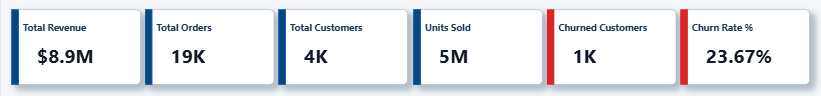
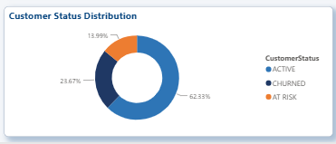
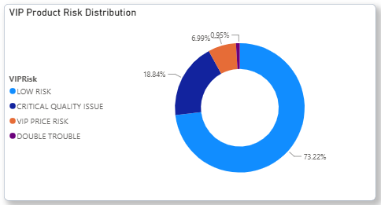
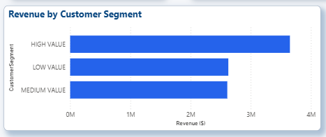

# Retail Customer & Churn Analysis

SQL + Power BI analysis of 4,338 retail customers, identifying churn drivers, revenue concentration, and product quality risk.

## The Business Question

A UK-based retail company had customers quietly disappearing, but no clear picture of why — which customers were actually at risk, and what was actually driving them away, versus just "churn is happening."

## The Approach

Using SQL (SSMS) to dig into the raw transaction data and Power BI to turn it into something stakeholders could actually act on, I built a full customer segmentation and churn analysis on the company's sales history.

## Key Findings

Customers were split into three groups — active, at-risk, and churned — based on a 152-day inactivity threshold, which flagged 23.67% of the customer base as churned. But the more useful question wasn't "who left," it was "why."

Two decision rules uncovered the real drivers: a product was flagged as having a **price issue** if its price had increased more than 15% from its starting price, and a **quality issue** if its return rate exceeded 10%. Running these against the customer segments showed quality problems were the dominant driver, not price — 451 products had quality issues among at-risk customers versus 210 with price issues, and the gap widened further for churned customers (545 quality-flagged products vs. 188 price-flagged).

Among VIP customers specifically, 636 products carried quality risk, and 32 products hit both flags at once — "Double Trouble" products that were overpriced *and* underdelivering, the worst possible combination for retention.

Zooming out, the churned customer base wasn't evenly distributed — a small segment, roughly 26% of customers, was responsible for 80% of total revenue. The segment breakdown below shows this concentration clearly: a small high-value group drives a disproportionate share of revenue, meaning the business's real retention priority isn't "stop all churn equally," it's protecting that concentrated, high-value group first.

## The Catch

Early in the build, a filter on the dashboard silently stopped working, and the visuals started showing numbers that didn't add up. Tracing it back, the issue was in the data model — Power BI had auto-generated the table relationships incorrectly, with a many-to-many connection where a one-to-many was needed, and every table ended up cross-connected instead of following a clean structure. I corrected the relationships manually before trusting any of the visuals again. It's an easy mistake to miss because the dashboard still *looks* fine until you actually test a filter.

## Tools Used

SQL Server (SSMS) · Power BI · DAX
